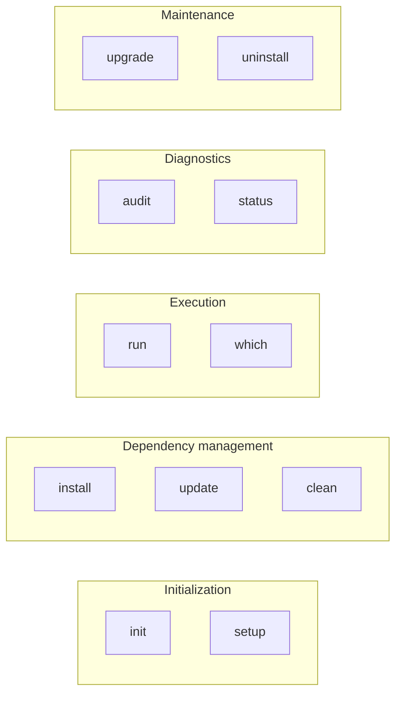

# Commands

Full reference for all adiboupk commands.

---

## Overview



---

## `setup`

All-in-one: scans the project, creates venvs, installs dependencies, and audits for conflicts.

```bash
adiboupk setup
```

Equivalent to running `init` + `install` + `audit` in sequence.

!!! tip "First time use"
    This is the command to use when you first set up adiboupk on an existing project.

---

## `init`

Scans the project and generates `adiboupk.json`.

```bash
adiboupk init
```

Detects:

- Subdirectories containing a `requirements.txt`
- A `requirements.txt` at the project root
- `requirements-*.txt` files (subgroups)

!!! note
    `init` does not create venvs. Run `install` afterwards.

---

## `install`

Creates venvs and installs dependencies for each group.

```bash
adiboupk install
adiboupk install --force    # Reinstall even if up to date
```

Behavior:

- Skips groups whose `requirements.txt` hasn't changed (SHA-256 comparison)
- In `isolate_packages` mode, installs each package into its own directory
- Updates `adiboupk.lock` after each successful installation

---

## `update`

Re-scans groups and reinstalls changed dependencies.

```bash
adiboupk update
adiboupk update --force
```

Differences from `install`:

| | `install` | `update` |
|---|---|---|
| Re-scans groups | No | Yes |
| Detects new modules | No | Yes |
| Removes orphaned venvs | No | Yes |
| Checks for adiboupk updates | No | Yes |

---

## `run`

Runs a Python script using its group's venv.

```bash
adiboupk run <script.py> [args...]
```

```bash
# Examples
adiboupk run ./Enrichments/cortex_lookup.py hostname123
adiboupk run ./scripts/process.py --input data.csv --output result.json
```

!!! warning "Process replacement"
    `run` replaces the current process (`exec`). The exit code is that of the Python script.

If no group matches the script, adiboupk falls back to system python.

---

## `audit`

Detects dependency conflicts.

```bash
adiboupk audit
```

Two types of checks:

1. **Cross-group conflicts** — different versions of the same package across `requirements.txt` files
2. **Transitive conflicts** — `pip check` inside each venv to detect sub-dependency incompatibilities

Example output:

```
==> Cross-group conflicts (requirements.txt)...
  requests:
    Enrichments: ==2.28.0
    Responses:   ==2.32.5

==> Transitive dependency conflicts (sub-dependencies)...
  Enrichments: No broken requirements found.
  Responses: No broken requirements found.
```

---

## `status`

Shows the state of each group.

```bash
adiboupk status
```

```
Project: /home/user/my-project
Venvs:   /home/user/my-project/.venvs

  Enrichments
    Directory:    ./Enrichments
    Requirements: ./Enrichments/requirements.txt
    Hash:         a1b2c3d4e5f6...
    Venv:         OK
    Status:       UP TO DATE
    Deps:         OK

  Responses
    Directory:    ./Responses
    Requirements: ./Responses/requirements.txt
    Hash:         f6e5d4c3b2a1...
    Venv:         MISSING
    Status:       NEEDS INSTALL
```

In `isolate_packages` mode, also shows isolation status:

```
    Isolation:    OK
```

---

## `which`

Shows which Python binary would be used for a script.

```bash
adiboupk which <script.py>
```

```bash
$ adiboupk which ./Enrichments/cortex_lookup.py
/home/user/my-project/.venvs/Enrichments/bin/python (group: Enrichments)
```

---

## `clean`

Removes all managed venvs and isolation directories.

```bash
adiboupk clean
```

Removes:

- Venvs in `.venvs/<group>/`
- Isolation directories `.venvs/<group>_isolated/`
- Resets the lock file

!!! note
    `clean` does not remove `adiboupk.json`. Use `uninstall` to remove everything.

---

## `upgrade`

Updates adiboupk itself.

```bash
adiboupk upgrade
adiboupk upgrade --force    # Skip confirmation
```

Checks the latest version on GitHub, clones, compiles, and replaces the binary.

---

## `uninstall`

Removes adiboupk and project files.

```bash
adiboupk uninstall
adiboupk uninstall --force    # Skip confirmation
```

Removes:

1. Project files (`.venvs/`, `adiboupk.json`, `adiboupk.lock`)
2. The adiboupk binary itself

---

## Global Options

These options apply to all commands:

| Option | Description |
|---|---|
| `--root <path>` | Project root directory (default: current directory) |
| `--force` | Force the operation (reinstall, delete without confirmation) |
| `--verbose` | Detailed output |
