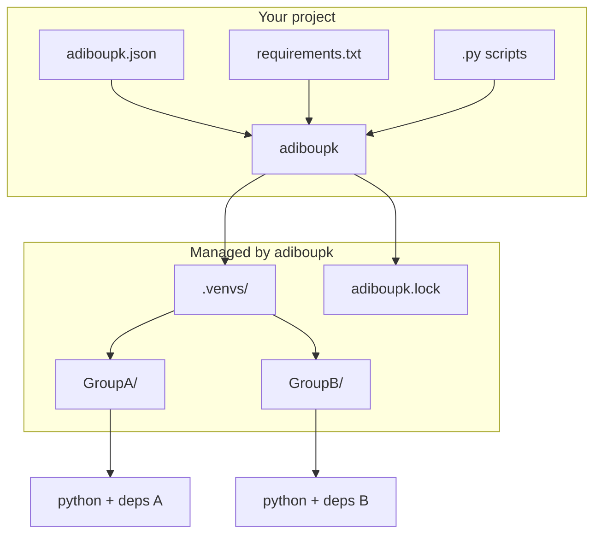
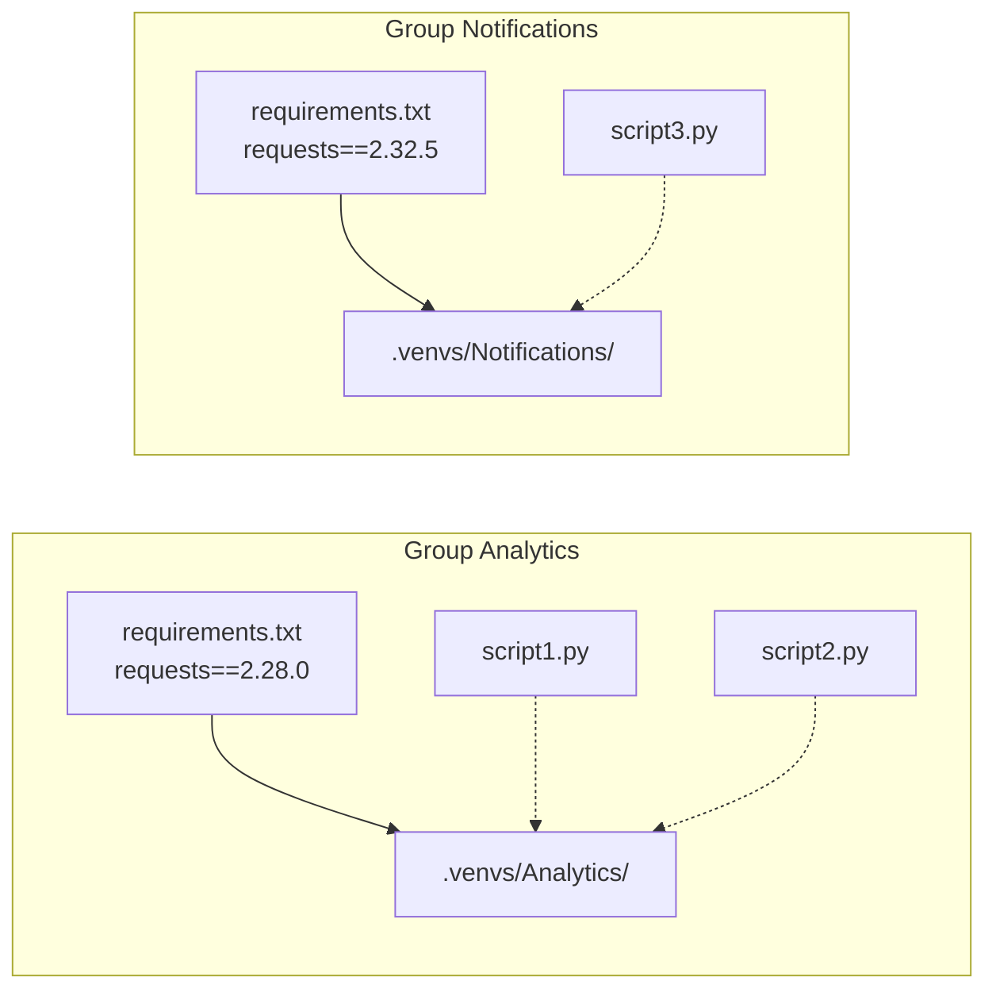
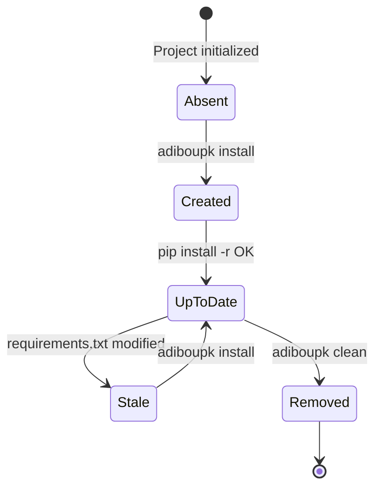
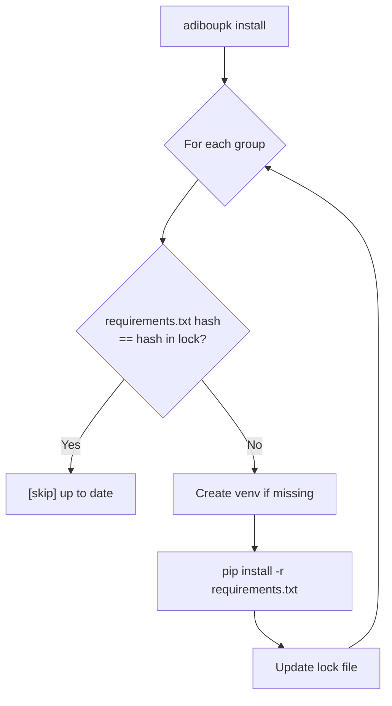
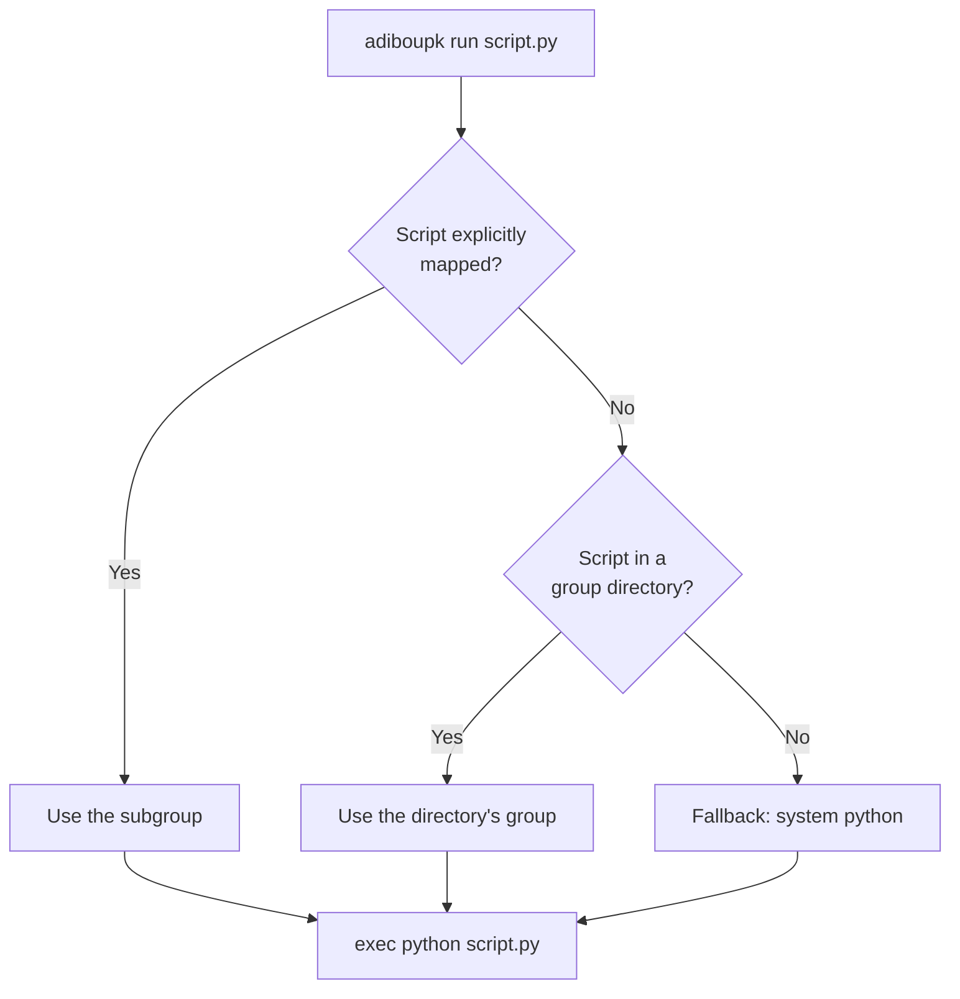
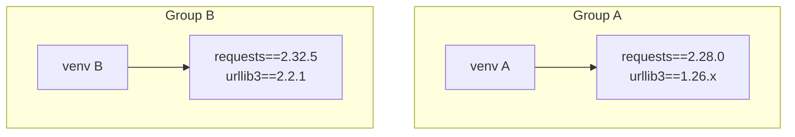
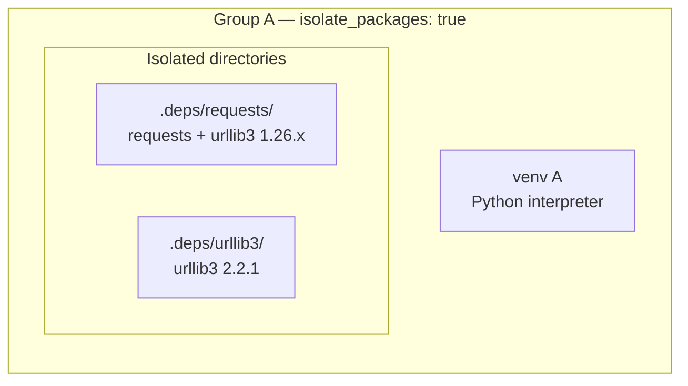

---
hide:
  - navigation
---

# Concepts

This page explains the core concepts behind adiboupk.

---

## Overall Architecture



---

## Groups

A **group** is a set of Python scripts that share the same dependencies. Each group has:

- A **name** (e.g. `Analytics`)
- A **directory** containing the scripts
- A **requirements.txt** listing the dependencies
- A **dedicated venv** in `.venvs/`



### Auto-discovery

`adiboupk init` scans the project to find groups:

1. Each **subdirectory** containing a `requirements.txt` becomes a group
2. A `requirements.txt` **at the project root** also creates a group
3. Ignored directories: `.git`, `node_modules`, `build`, `__pycache__`, etc.

### Subgroups

A directory can contain multiple `requirements-*.txt` files to create subgroups:

```
Analytics/
├── requirements.txt          → group "Analytics" (fallback)
├── requirements-vt.txt       → subgroup "Analytics/vt"
├── requirements-data.txt   → subgroup "Analytics/data"
├── script_vt.py              → mapped to "Analytics/vt"
└── data_fetch.py          → mapped to "Analytics/data"
```

Scripts are automatically associated with the subgroup whose suffix appears in their filename.

---

## Virtual Environments (venvs)

Each group gets its own Python venv in the `.venvs/` directory:

```
.venvs/
├── Analytics/
│   ├── bin/python
│   ├── lib/python3.x/site-packages/
│   │   ├── requests/
│   │   └── ...
│   └── pyvenv.cfg
└── Notifications/
    ├── bin/python
    └── lib/python3.x/site-packages/
        ├── requests/
        └── ...
```

### Lifecycle



---

## Lock File

The `adiboupk.lock` file stores the **SHA-256 hash** of each `requirements.txt` at install time. This allows:

- **Skipping** groups whose dependencies haven't changed
- **Detecting** when a reinstall is needed

```json
{
  "groups": {
    "Analytics": {
      "requirements_hash": "a1b2c3d4e5f6...",
      "installed": true
    },
    "Notifications": {
      "requirements_hash": "f6e5d4c3b2a1...",
      "installed": true
    }
  }
}
```

### Install Flow



---

## Script Resolution

When you run `adiboupk run script.py`, adiboupk determines which venv to use:



Resolution priority:

1. **Explicit mapping** — the script is listed in a group's `scripts` field
2. **Subgroup** — the script's directory matches a subgroup
3. **Parent group** — the script's directory is under a group
4. **Fallback** — system python if no group matches

---

## Two Isolation Modes

adiboupk offers two levels of isolation:

### Standard mode (default)

Each **group** gets its own venv. Conflicts **between groups** are resolved.



### Per-package isolation mode

Each **package** gets its own directory. Conflicts **within a single group** are resolved.



→ See [Per-Package Isolation](isolation.md) for details.
