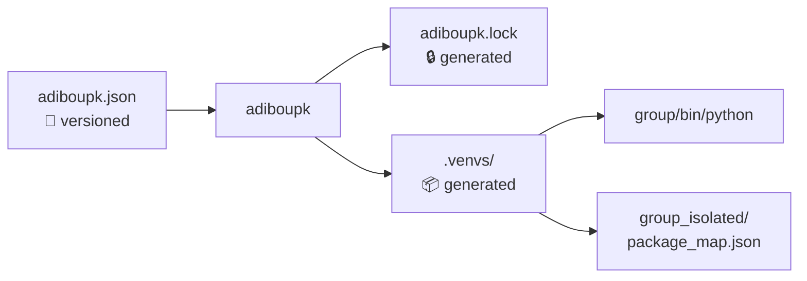

---
hide:
  - navigation
---

# Configuration

adiboupk uses two configuration files: `adiboupk.json` (user-editable) and `adiboupk.lock` (auto-generated).

---

## `adiboupk.json`

Main configuration file, located at the project root. Created by `adiboupk init` or manually.

### Full Structure

```json
{
  "venvs_dir": ".venvs",
  "python": "/usr/bin/python3.11",
  "isolate_packages": true,
  "groups": [
    {
      "name": "Analytics",
      "directory": "Analytics",
      "requirements": "Analytics/requirements.txt",
      "scripts": ["data_fetch.py", "api_scan.py"]
    }
  ]
}
```

### Global Fields

| Field | Type | Default | Description |
|---|---|---|---|
| `venvs_dir` | `string` | `".venvs"` | Directory where venvs are stored |
| `python` | `string` | auto-detected | Path to the Python interpreter |
| `isolate_packages` | `bool` | `false` | Enable per-package isolation |
| `groups` | `array` | `[]` | List of module groups |

### Group Fields

| Field | Type | Required | Description |
|---|---|---|---|
| `name` | `string` | ✅ | Unique group name |
| `directory` | `string` | ✅ | Directory containing the scripts |
| `requirements` | `string` | No | Path to requirements.txt (default: `<directory>/requirements.txt`) |
| `scripts` | `array` | No | Explicit list of associated scripts |

---

## Configuration Examples

### Simple project — one module per directory

```
project/
├── Analytics/
│   ├── requirements.txt
│   └── script.py
├── Notifications/
│   ├── requirements.txt
│   └── script.py
└── adiboupk.json
```

```json
{
  "venvs_dir": ".venvs",
  "groups": [
    {
      "name": "Analytics",
      "directory": "Analytics"
    },
    {
      "name": "Notifications",
      "directory": "Notifications"
    }
  ]
}
```

!!! tip
    This configuration is generated automatically by `adiboupk init`.

### Project with subgroups

```
project/
├── Analytics/
│   ├── requirements-vt.txt
│   ├── requirements-data.txt
│   ├── script_vt.py
│   └── data_fetch.py
└── adiboupk.json
```

```json
{
  "venvs_dir": ".venvs",
  "groups": [
    {
      "name": "Analytics/vt",
      "directory": "Analytics",
      "requirements": "Analytics/requirements-vt.txt",
      "scripts": ["script_vt.py"]
    },
    {
      "name": "Analytics/data",
      "directory": "Analytics",
      "requirements": "Analytics/requirements-data.txt",
      "scripts": ["data_fetch.py"]
    }
  ]
}
```

### Single-directory project with isolation

```
project/
├── requirements.txt
├── script_a.py
├── script_b.py
└── adiboupk.json
```

```json
{
  "venvs_dir": ".venvs",
  "isolate_packages": true,
  "groups": [
    {
      "name": "project",
      "directory": "."
    }
  ]
}
```

### Custom Python

```json
{
  "python": "/opt/python3.11/bin/python3",
  "venvs_dir": ".venvs",
  "groups": [
    {
      "name": "api",
      "directory": "api"
    }
  ]
}
```

### Venvs in an external directory

```json
{
  "venvs_dir": "/tmp/my-project-venvs",
  "groups": [
    {
      "name": "worker",
      "directory": "worker"
    }
  ]
}
```

---

## `adiboupk.lock`

Auto-generated file created by `adiboupk install`. **Do not edit manually.**

```json
{
  "groups": {
    "Analytics": {
      "requirements_hash": "a1b2c3d4e5f6789...",
      "installed": true
    },
    "Notifications": {
      "requirements_hash": "9876f5e4d3c2b1a...",
      "installed": true
    }
  }
}
```

| Field | Description |
|---|---|
| `requirements_hash` | SHA-256 of `requirements.txt` at install time |
| `installed` | `true` if installation succeeded |

The lock file allows `adiboupk install` to **skip** groups whose dependencies haven't changed. Use `--force` to ignore the lock and reinstall everything.

---

## `.gitignore`

Add these entries to your `.gitignore`:

```gitignore
# adiboupk
.venvs/
adiboupk.lock
```

The `adiboupk.json` file **should** be versioned — it's the shared project configuration.

---

## Generated Files



| File | Version control? | Description |
|---|---|---|
| `adiboupk.json` | ✅ Yes | Project configuration |
| `adiboupk.lock` | ❌ No | Local install state |
| `.venvs/` | ❌ No | Venvs and isolated packages |
