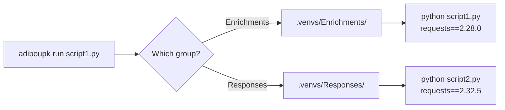

---
hide:
  - navigation
  - toc
---

<div class="hero">


<p class="hero-tagline">Python dependency isolation<br>for multi-module projects.</p>
<p class="hero-sub">Written in C++ · ~1ms overhead · Zero conflicts</p>

<div class="hero-buttons">
  <a href="installation/" class="btn-primary">Get Started</a>
  <a href="https://github.com/NoahPodcast/adiboupk" class="btn-secondary">View on GitHub</a>
</div>

<div class="install-block">
  <div class="install-label">Install with one command</div>
  <div class="install-cmd">
    <code>curl -sSL https://raw.githubusercontent.com/NoahPodcast/adiboupk/main/install.sh | bash</code>
    <button class="install-copy" onclick="navigator.clipboard.writeText('curl -sSL https://raw.githubusercontent.com/NoahPodcast/adiboupk/main/install.sh | bash')" title="Copy">
      &#x2398;
    </button>
  </div>
</div>

</div>

<div class="features" markdown>

<div class="feature-card" markdown>

### :material-folder-multiple: Group Isolation

One venv per directory. Each module gets its own dependencies without conflicts.

</div>

<div class="feature-card" markdown>

### :material-package-variant-closed: Package Isolation

Fine-grained control — isolate individual packages when needed.

</div>

<div class="feature-card" markdown>

### :material-lightning-bolt: Native Performance

C++ binary with ~1ms overhead. No Python runtime needed for the CLI.

</div>

<div class="feature-card" markdown>

### :material-shield-check: Dependency Audit

Detect version conflicts across groups before they break production.

</div>

<div class="feature-card" markdown>

### :material-lock: Smart Lock File

Reinstalls only when requirements.txt changes. No wasted time.

</div>

<div class="feature-card" markdown>

### :material-microsoft-windows: Cross-Platform

Linux and Windows from the same codebase.

</div>

</div>

---

## The Problem

When a project contains multiple Python modules each with their own `requirements.txt`, a global `pip install` causes version conflicts — the last install wins, silently breaking other modules.

```
project/
├── Enrichments/
│   ├── script1.py
│   └── requirements.txt    ← requests==2.28.0
├── Responses/
│   ├── script2.py
│   └── requirements.txt    ← requests==2.32.5
```

`script1.py` expects `requests 2.28.0` but gets `2.32.5` (or vice versa).

## The Solution

**adiboupk** creates an isolated venv per group of scripts and transparently routes each execution to the correct environment.



## Quick Start

```bash
# Install
curl -sSL https://raw.githubusercontent.com/NoahPodcast/adiboupk/main/install.sh | bash

# Initialize & run
cd my-project/
adiboupk setup
adiboupk run ./Enrichments/cortex_lookup.py hostname123
```

Each script automatically uses the correct dependencies.

## Integration

Replace `python` with `adiboupk run` in your orchestration scripts:

```javascript
// Before — global python, version conflicts
var cmd = 'python ./Enrichments/cortex_lookup.py ' + hostname;

// After — isolated per group
var cmd = 'adiboupk run ./Enrichments/cortex_lookup.py ' + hostname;
```
