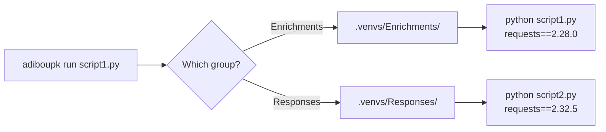

<div class="hero">


<h1>adiboupk</h1>

<p class="hero-tagline">
Python dependency isolation for multi-module projects.<br>
Written in C++ for ~1ms startup overhead.
</p>

<div class="hero-buttons">
  <a href="installation/" class="btn-primary">Get Started</a>
  <a href="https://github.com/NoahPodcast/adiboupk" class="btn-secondary">View on GitHub</a>
</div>

<div class="hero-install">
  <code>curl -sSL https://raw.githubusercontent.com/NoahPodcast/adiboupk/main/install.sh | bash</code>
</div>

</div>

<div class="features">

<div class="feature-card">
<h3>:material-folder-multiple: Group Isolation</h3>
<p>One venv per directory. Each module gets its own dependencies without conflicts.</p>
</div>

<div class="feature-card">
<h3>:material-package-variant-closed: Package Isolation</h3>
<p>Fine-grained control — isolate individual packages when needed.</p>
</div>

<div class="feature-card">
<h3>:material-lightning-bolt: Native Performance</h3>
<p>C++ binary with ~1ms overhead. No Python runtime needed for the CLI.</p>
</div>

<div class="feature-card">
<h3>:material-shield-check: Dependency Audit</h3>
<p>Detect version conflicts across groups before they break production.</p>
</div>

<div class="feature-card">
<h3>:material-lock: Smart Lock File</h3>
<p>Reinstalls only when requirements.txt changes. No wasted time.</p>
</div>

<div class="feature-card">
<h3>:material-microsoft-windows: Cross-Platform</h3>
<p>Linux and Windows from the same codebase.</p>
</div>

</div>

---

## The Problem

When a project contains multiple Python modules each with their own `requirements.txt`, a global `pip install` causes version conflicts — the last install wins, silently breaking other modules.

```
project/
├── Enrichments/
│   ├── script1.py
│   └── requirements.txt    ← requests==2.28.0
├── Responses/
│   ├── script2.py
│   └── requirements.txt    ← requests==2.32.5
```

`script1.py` expects `requests 2.28.0` but gets `2.32.5` (or vice versa).

## The Solution

**adiboupk** creates an isolated venv per group of scripts and transparently routes each execution to the correct environment.



## Quick Start

```bash
# Install
curl -sSL https://raw.githubusercontent.com/NoahPodcast/adiboupk/main/install.sh | bash

# Initialize & run
cd my-project/
adiboupk setup
adiboupk run ./Enrichments/cortex_lookup.py hostname123
```

Each script automatically uses the correct dependencies.

## Integration

Replace `python` with `adiboupk run` in your orchestration scripts:

```javascript
// Before — global python, version conflicts
var cmd = 'python ./Enrichments/cortex_lookup.py ' + hostname;

// After — isolated per group
var cmd = 'adiboupk run ./Enrichments/cortex_lookup.py ' + hostname;
```
