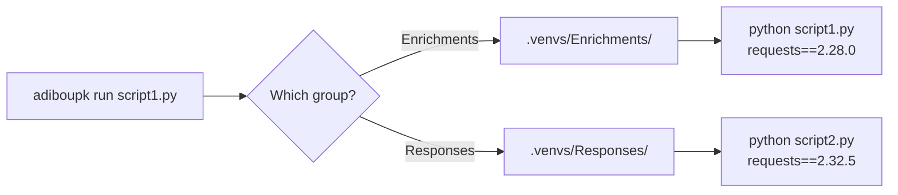

# adiboupk

**Python dependency isolation for multi-module projects.** Written in C++ for ~1ms startup overhead.

---

## The Problem

When a project contains multiple Python modules each with their own `requirements.txt`, a global `pip install` causes version conflicts — the last install wins, silently breaking other modules.

```
project/
├── Enrichments/
│   ├── script1.py
│   └── requirements.txt    ← requests==2.28.0
├── Responses/
│   ├── script2.py
│   └── requirements.txt    ← requests==2.32.5
```

:material-arrow-right: `script1.py` expects `requests 2.28.0` but gets `2.32.5` (or vice versa).

## The Solution

**adiboupk** creates an **isolated venv per group** of scripts and transparently routes each execution to the correct environment.



## Quick Start

```bash
# 1. Install
curl -sSL https://raw.githubusercontent.com/NoahPodcast/adiboupk/main/install.sh | bash

# 2. Initialize the project
cd my-project/
adiboupk setup

# 3. Run a script
adiboupk run ./Enrichments/cortex_lookup.py hostname123
```

That's it. Each script automatically uses the correct dependencies.

## Features

| Feature | Description |
|---|---|
| :material-folder-multiple: **Group isolation** | One venv per directory/module |
| :material-package-variant-closed: **Package isolation** | Each package in its own directory |
| :material-lock: **Lock file** | Reinstall only when `requirements.txt` changes |
| :material-shield-check: **Audit** | Detect conflicts across groups |
| :material-update: **Self-update** | `adiboupk upgrade` to update itself |
| :material-microsoft-windows: **Cross-platform** | Linux and Windows from the same codebase |
| :material-lightning-bolt: **Fast** | Native C++ binary, ~1ms overhead |

## Integration

Simply replace `python` with `adiboupk run` in your orchestration scripts:

```javascript
// Before — global python, version conflicts
var cmd = 'python ./Enrichments/cortex_lookup.py ' + hostname;

// After — isolated venv per group
var cmd = 'adiboupk run ./Enrichments/cortex_lookup.py ' + hostname;
```
