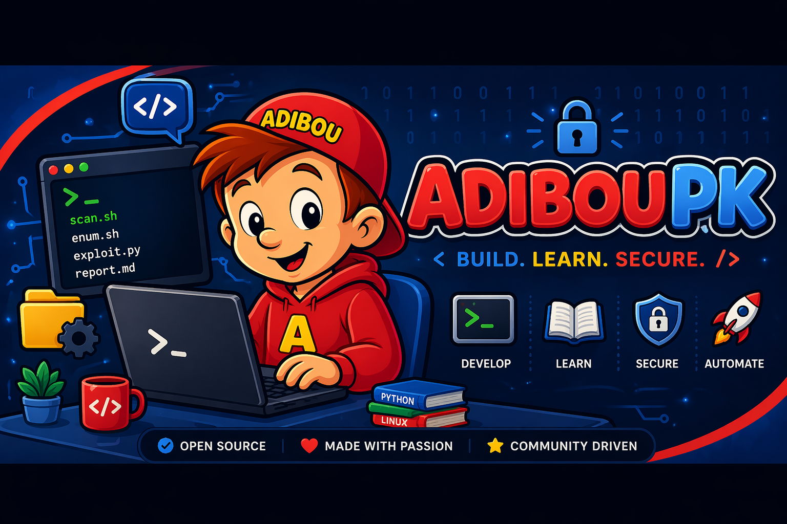
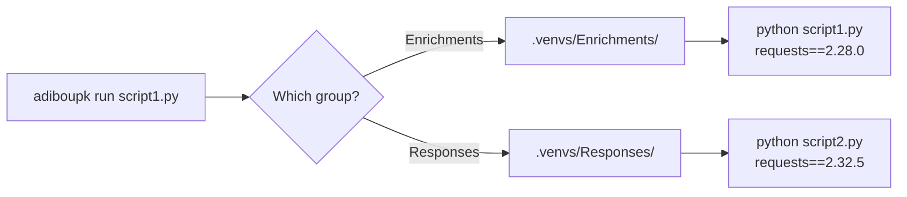

<div class="hero" markdown>



# adiboupk

**Python dependency isolation for multi-module projects.**
Written in C++ for ~1ms startup overhead.

<div class="hero-buttons">
  <a href="installation/" class="btn-primary">Get Started</a>
  <a href="https://github.com/NoahPodcast/adiboupk" class="btn-secondary">GitHub</a>
</div>

</div>

<div class="features" markdown>

<div class="feature-card" markdown>
### :material-folder-multiple: Group Isolation
One venv per directory/module. Each group gets its own dependencies without conflicts.
</div>

<div class="feature-card" markdown>
### :material-package-variant-closed: Package Isolation
Each package in its own directory for fine-grained control over dependency versions.
</div>

<div class="feature-card" markdown>
### :material-lightning-bolt: Native Performance
Written in C++ — ~1ms startup overhead. No Python runtime needed for the CLI itself.
</div>

<div class="feature-card" markdown>
### :material-shield-check: Dependency Audit
Detect version conflicts across groups before they break your scripts.
</div>

<div class="feature-card" markdown>
### :material-lock: Smart Lock File
Reinstalls only when `requirements.txt` changes. No wasted time.
</div>

<div class="feature-card" markdown>
### :material-microsoft-windows: Cross-Platform
Linux and Windows from the same codebase. Works everywhere.
</div>

</div>

---

## The Problem

When a project contains multiple Python modules each with their own `requirements.txt`, a global `pip install` causes version conflicts — the last install wins, silently breaking other modules.

```
project/
├── Enrichments/
│   ├── script1.py
│   └── requirements.txt    ← requests==2.28.0
├── Responses/
│   ├── script2.py
│   └── requirements.txt    ← requests==2.32.5
```

:material-arrow-right: `script1.py` expects `requests 2.28.0` but gets `2.32.5` (or vice versa).

## The Solution

**adiboupk** creates an **isolated venv per group** of scripts and transparently routes each execution to the correct environment.



## Quick Start

```bash
# 1. Install
curl -sSL https://raw.githubusercontent.com/NoahPodcast/adiboupk/main/install.sh | bash

# 2. Initialize the project
cd my-project/
adiboupk setup

# 3. Run a script
adiboupk run ./Enrichments/cortex_lookup.py hostname123
```

That's it. Each script automatically uses the correct dependencies.

## Integration

Simply replace `python` with `adiboupk run` in your orchestration scripts:

```javascript
// Before — global python, version conflicts
var cmd = 'python ./Enrichments/cortex_lookup.py ' + hostname;

// After — isolated venv per group
var cmd = 'adiboupk run ./Enrichments/cortex_lookup.py ' + hostname;
```
