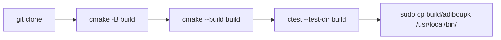

# Installation

adiboupk is a statically linked C++ binary. No runtime dependencies are needed (besides Python for your scripts).

## Prerequisites

- **Python 3.7+** with `pip` and `venv`
- **CMake 3.16+** and a C++17 compiler (installed automatically by the script)

---

## Quick Install

=== "Linux / macOS"

    ```bash
    curl -sSL https://raw.githubusercontent.com/NoahPodcast/adiboupk/main/install.sh | bash
    ```

    The script:

    1. Installs `cmake` and `g++` if needed
    2. Clones the repo into a temporary directory
    3. Compiles in Release mode
    4. Copies the binary to `/usr/local/bin`

=== "Windows (PowerShell admin)"

    ```powershell
    irm https://raw.githubusercontent.com/NoahPodcast/adiboupk/main/install.ps1 | iex
    ```

    The script:

    1. Installs CMake and VS Build Tools via `winget` if needed
    2. Clones, compiles, and adds the binary to PATH

=== "From cloned repo"

    ```bash
    git clone https://github.com/NoahPodcast/adiboupk.git
    cd adiboupk
    mkdir build && cd build
    cmake .. -DCMAKE_BUILD_TYPE=Release
    make -j$(nproc)
    sudo cp adiboupk /usr/local/bin/
    ```

## Verify

```bash
adiboupk version
```

```
adiboupk 1.5.2
```

## Update

```bash
adiboupk upgrade
```

Or reinstall manually:

```bash
curl -sSL https://raw.githubusercontent.com/NoahPodcast/adiboupk/main/install.sh | bash
```

## Uninstall

```bash
adiboupk uninstall
```

Removes the binary and (optionally) project files (`.venvs/`, `adiboupk.json`, `adiboupk.lock`).

## Building from Source



### CMake Options

| Option | Default | Description |
|---|---|---|
| `CMAKE_BUILD_TYPE` | `Debug` | `Release` for an optimized binary |
| `BUILD_TESTS` | `ON` | `OFF` to skip tests |

### Running Tests

```bash
cmake -B build
cmake --build build
ctest --test-dir build --output-on-failure
```
