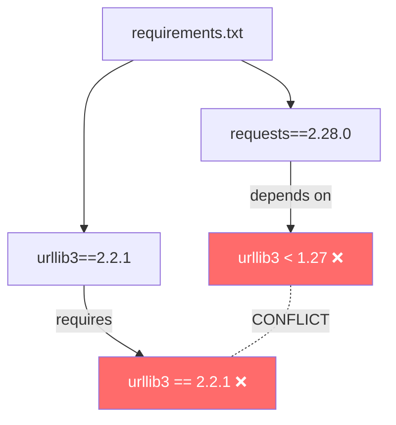
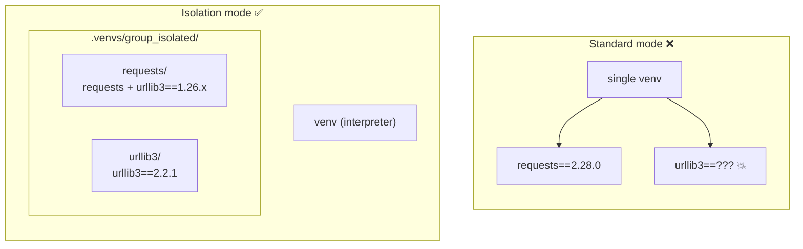
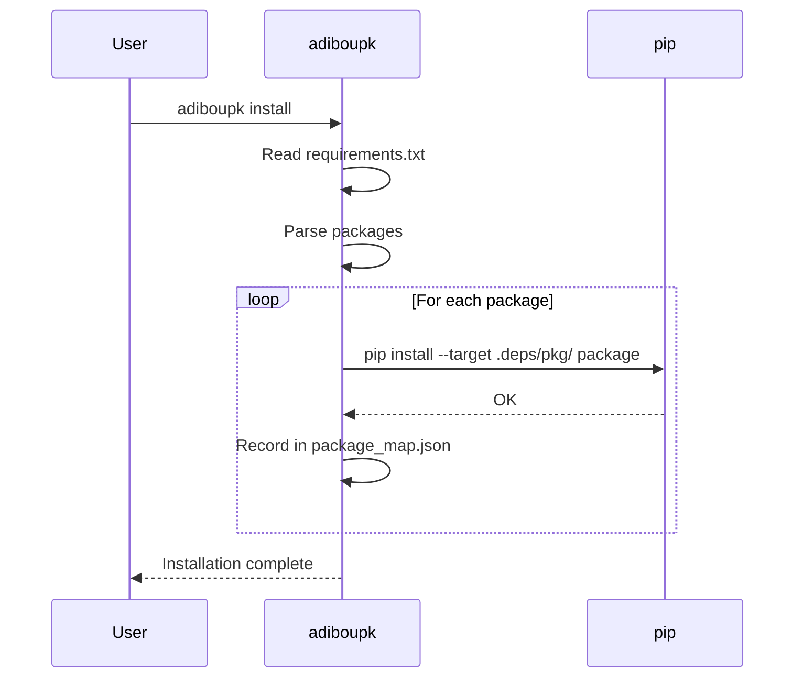
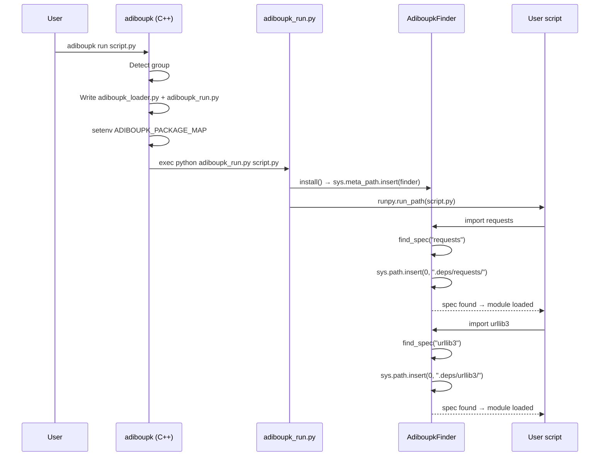

---
hide:
  - navigation
---

# Per-Package Isolation

Per-package isolation mode resolves dependency conflicts **within a single group** — when two packages in the same `requirements.txt` have incompatible transitive dependencies.

---

## The Problem

Consider this `requirements.txt`:

```
requests==2.28.0
urllib3==2.2.1
```

In standard mode, `pip install` fails:

```
ERROR: Cannot install requests==2.28.0 and urllib3==2.2.1
because these package versions have conflicting dependencies.
```

Why? `requests==2.28.0` depends on `urllib3<1.27`, but we also explicitly need `urllib3==2.2.1`.



---

## The Solution

With `isolate_packages: true`, each package is installed into its own directory via `pip install --target`. Each package bundles its own transitive dependencies, with no interference.



---

## Enabling It

Add `isolate_packages: true` to `adiboupk.json`:

```json
{
  "isolate_packages": true,
  "venvs_dir": ".venvs",
  "groups": [
    {
      "name": "my_group",
      "directory": ".",
      "requirements": "requirements.txt"
    }
  ]
}
```

Then:

```bash
adiboupk install
adiboupk run my_script.py
```

---

## How It Works

### Install Phase



For each package in `requirements.txt`:

1. Creates a directory `.venvs/<group>_isolated/<package>/`
2. Runs `pip install --target=<dir> <package>`
3. Each package gets its own transitive dependencies in its directory

Result:

```
.venvs/my_group_isolated/
├── package_map.json          ← package → directory mapping
├── requests/
│   ├── requests/             ← the requests package
│   ├── urllib3/              ← urllib3 1.26.x (requests' dependency)
│   ├── certifi/
│   └── charset_normalizer/
└── urllib3/
    └── urllib3/              ← urllib3 2.2.1 (explicitly installed)
```

### `package_map.json`

Automatically generated file mapping each package to its directory:

```json
{
  "requests": "/absolute/path/.venvs/my_group_isolated/requests",
  "urllib3": "/absolute/path/.venvs/my_group_isolated/urllib3"
}
```

### Runtime Phase



### The Import Hook (`AdiboupkFinder`)

The core of the system is a Python `MetaPathFinder` injected into `sys.meta_path`:

```python
class AdiboupkFinder(importlib.abc.MetaPathFinder):
    def find_spec(self, fullname, path, target=None):
        # 1. Extract the top-level package (e.g. "requests.sessions" → "requests")
        top_level = fullname.split(".")[0].lower()

        # 2. Check if we have a mapping for this package
        if top_level not in self._map:
            return None

        # 3. Add the isolated directory to sys.path
        sys.path.insert(0, self._map[top_level])

        # 4. Temporarily remove ourselves from sys.meta_path
        sys.meta_path.remove(self)
        try:
            # 5. Let the standard PathFinder find the module
            importlib.invalidate_caches()
            return importlib.util.find_spec(fullname)
        finally:
            # 6. Re-insert ourselves
            sys.meta_path.insert(0, self)
```

Key points:

- The finder **temporarily removes itself** from `sys.meta_path` to avoid infinite recursion
- `importlib.invalidate_caches()` is required because `sys.path` was modified
- Each package's directory stays in `sys.path` so its internal sub-imports work

---

## Limitations

!!! warning "Compatibility warnings"
    Some packages check their dependency versions at import time.
    For example, `requests` emits a `RequestsDependencyWarning` if it detects
    a different `urllib3` version than expected. This is cosmetic —
    functionality is not affected.

!!! info "Disk space"
    In isolation mode, each package bundles its own transitive dependencies.
    If two packages depend on `certifi`, it will be installed twice.
    This is the trade-off for guaranteeing no conflicts.

---

## When to Use It

| Situation | Recommended mode |
|---|---|
| Conflicts **between groups** (different directories) | Standard (default) |
| Conflicts **within a group** (same requirements.txt) | `isolate_packages: true` |
| No conflicts | Standard (default) |
| Limited disk space | Standard (default) |
