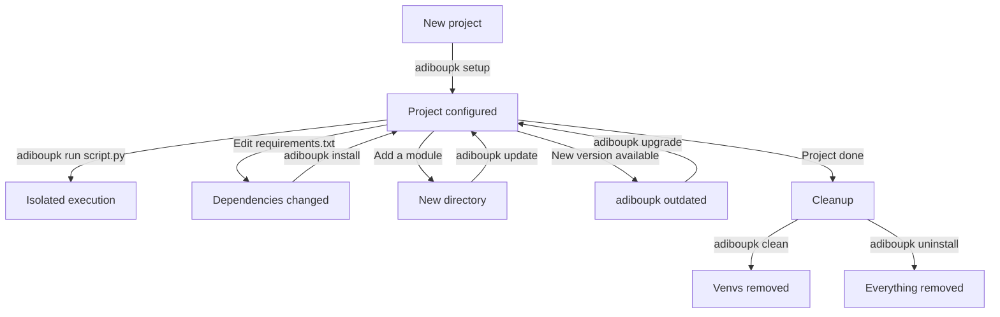

# Tutorial

This guide walks you through using adiboupk step by step, from the simplest project to the most advanced use case.

---

## Scenario 1 — Multi-module Project

### Project Structure

You have a SOAR project with multiple modules, each with its own dependencies:

```
soar-project/
├── Enrichments/
│   ├── cortex_lookup.py
│   ├── vt_scan.py
│   └── requirements.txt      ← requests==2.28.0, cortex4py==2.0.1
├── Responses/
│   ├── send_email.py
│   ├── block_ip.py
│   └── requirements.txt      ← requests==2.32.5, smtplib2==1.0
└── Utilities/
    ├── cleanup.py
    └── requirements.txt       ← boto3==1.34.0
```

### Step 1 — Initialize

```bash
cd soar-project/
adiboupk setup
```

```
==> Scanning /home/user/soar-project for module groups...
Found 3 group(s):
  - Enrichments (./Enrichments/requirements.txt)
  - Responses (./Responses/requirements.txt)
  - Utilities (./Utilities/requirements.txt)
Created adiboupk.json

==> Installing dependencies...
  [install] Enrichments
    Creating venv...
    Installing dependencies...
    Done.
  [install] Responses
    Creating venv...
    Installing dependencies...
    Done.
  [install] Utilities
    Creating venv...
    Installing dependencies...
    Done.

==> Auditing for cross-group conflicts...
  requests:
    Enrichments: ==2.28.0
    Responses:   ==2.32.5

Setup complete. Use 'adiboupk run <script.py>' to execute scripts.
```

!!! note "Conflict detected"
    The audit reports that `requests` has different versions between Enrichments and Responses.
    This is expected — it's exactly what adiboupk solves by isolating each group.

### Step 2 — Run scripts

```bash
# Uses the Enrichments venv (requests==2.28.0)
adiboupk run ./Enrichments/cortex_lookup.py hostname123

# Uses the Responses venv (requests==2.32.5)
adiboupk run ./Responses/send_email.py alert@company.com

# Uses the Utilities venv (boto3)
adiboupk run ./Utilities/cleanup.py --older-than 30d
```

### Step 3 — Check status

```bash
adiboupk status
```

```
Project: /home/user/soar-project
Venvs:   /home/user/soar-project/.venvs

  Enrichments
    Directory:    ./Enrichments
    Requirements: ./Enrichments/requirements.txt
    Hash:         a1b2c3d4e5f6...
    Venv:         OK
    Status:       UP TO DATE
    Deps:         OK

  Responses
    ...
```

### Step 4 — Update after a change

You modify `Enrichments/requirements.txt` to add a package:

```bash
echo "shodan==1.31.0" >> Enrichments/requirements.txt
adiboupk install
```

```
Installing dependencies for 3 group(s)...
  [skip] Responses (up to date)
  [skip] Utilities (up to date)
  [install] Enrichments
    Installing dependencies...
    Done.
All groups installed successfully.
```

Only the modified group is reinstalled.

---

## Scenario 2 — Transitive Dependency Conflicts

### The Problem

Your `requirements.txt` contains packages with incompatible transitive dependencies:

```
# requirements.txt
requests==2.28.0      # depends on urllib3<1.27
urllib3==2.2.1         # explicit version, incompatible with requests
```

A standard `pip install` fails:

```
ERROR: Cannot install requests==2.28.0 and urllib3==2.2.1
because these package versions have conflicting dependencies.
```

### The Solution — per-package isolation

```bash
mkdir conflict-demo && cd conflict-demo

# Create requirements.txt
cat > requirements.txt << 'EOF'
requests==2.28.0
urllib3==2.2.1
EOF

# Create a test script
cat > test.py << 'EOF'
import requests
import urllib3
print(f"requests: {requests.__version__}")
print(f"urllib3: {urllib3.__version__}")
s = requests.Session()
print("Everything works!")
EOF

# Initialize
adiboupk init
```

Edit `adiboupk.json` to enable isolation:

```json
{
  "isolate_packages": true,
  "venvs_dir": ".venvs",
  "groups": [
    {
      "name": "conflict-demo",
      "directory": "."
    }
  ]
}
```

```bash
adiboupk install
```

```
Installing dependencies for 1 group(s)...
  [install] conflict-demo
    Creating venv...
    Installing packages in isolated mode...
      requests==2.28.0 -> requests/
      urllib3==2.2.1 -> urllib3/
    Done.
All groups installed successfully.
```

```bash
adiboupk run test.py
```

```
requests: 2.28.0
urllib3: 2.2.1
Everything works!
```

Both packages coexist without conflict.

---

## Scenario 3 — Subgroups

### Structure

A single directory contains scripts with different dependencies:

```
Enrichments/
├── requirements-vt.txt        ← vt-py==0.18.0
├── requirements-cortex.txt    ← cortex4py==2.0.1
├── script_vt.py
├── script_vt_bulk.py
└── cortex_lookup.py
```

### Initialization

```bash
adiboupk init
```

adiboupk automatically detects subgroups and maps scripts by naming convention:

```
Found 2 group(s):
  - Enrichments/cortex (./Enrichments/requirements-cortex.txt)
  - Enrichments/vt (./Enrichments/requirements-vt.txt)
```

Scripts containing `vt` in their name (`script_vt.py`, `script_vt_bulk.py`) are mapped to the `Enrichments/vt` subgroup. Those containing `cortex` (`cortex_lookup.py`) are mapped to `Enrichments/cortex`.

```bash
# Uses the Enrichments/vt venv
adiboupk run ./Enrichments/script_vt.py hash123

# Uses the Enrichments/cortex venv
adiboupk run ./Enrichments/cortex_lookup.py ip 1.2.3.4
```

---

## Scenario 4 — Orchestrator Integration

### Node.js / XSOAR

```javascript
const { execSync } = require('child_process');

// Before — global python
// const result = execSync('python ./Enrichments/cortex_lookup.py ' + hostname);

// After — isolated per group
const result = execSync('adiboupk run ./Enrichments/cortex_lookup.py ' + hostname);
```

### Bash / cron

```bash
#!/bin/bash
# Before
# python3 ./Enrichments/cortex_lookup.py "$1"

# After
adiboupk run ./Enrichments/cortex_lookup.py "$1"
```

### Wrapper Scripts

Wrappers are provided in `wrappers/` to transparently replace `python`:

=== "Bash"

    ```bash
    # wrappers/adiboupk-python.sh
    # Replaces 'python' with 'adiboupk run' if an adiboupk.json exists
    #!/bin/bash
    if [ -f "adiboupk.json" ] && command -v adiboupk &>/dev/null; then
        adiboupk run "$@"
    else
        python3 "$@"
    fi
    ```

=== "PowerShell"

    ```powershell
    # wrappers/adiboupk-python.ps1
    if ((Test-Path "adiboupk.json") -and (Get-Command adiboupk -ErrorAction SilentlyContinue)) {
        adiboupk run @args
    } else {
        python @args
    }
    ```

---

## Daily Workflow



---

## Command Summary by Stage

| Stage | Command | Frequency |
|---|---|---|
| First setup | `adiboupk setup` | Once |
| Run a script | `adiboupk run script.py` | Daily |
| After editing requirements | `adiboupk install` | As needed |
| After adding/removing modules | `adiboupk update` | As needed |
| Check status | `adiboupk status` | As needed |
| Detect conflicts | `adiboupk audit` | As needed |
| Update adiboupk | `adiboupk upgrade` | As needed |
| Clean venvs | `adiboupk clean` | As needed |
